Cookbook Anypoint&trade; Studio Connector Demo (Ingredient CRUD)
================================================================

## Introduction

The current demo application provides a complete workflow to **invoke Cookbook's standard operations** sequentially for a given Ingredient. 

## Prerequisites

* Java 7
* Anypoint Studio 5.4.x
* Mule Runtime 3.7.0 EE or higher
* DataWeave

## Import the project

* Go to **File > Import**
* Select **Anypoint Studio Project from External Location** (under the parent folder "Anypoint Studio")

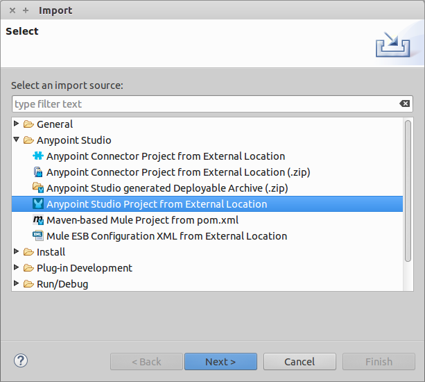

* Provide the root path to the demo project folder.
* Select Mule Runtime (3.7.x EE).

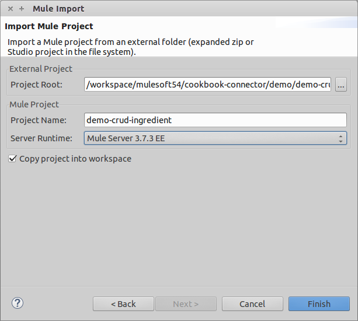

* Click **Finish**.  
* Set Cookbook credentials inside the file `src/main/app/mule-app.properties`.

```
config.username=<USERNAME>
config.password=<PASSWORD>
```
* Inside the Global Elements view, double-click the Cookbook Configuration component and click "Test Connection".

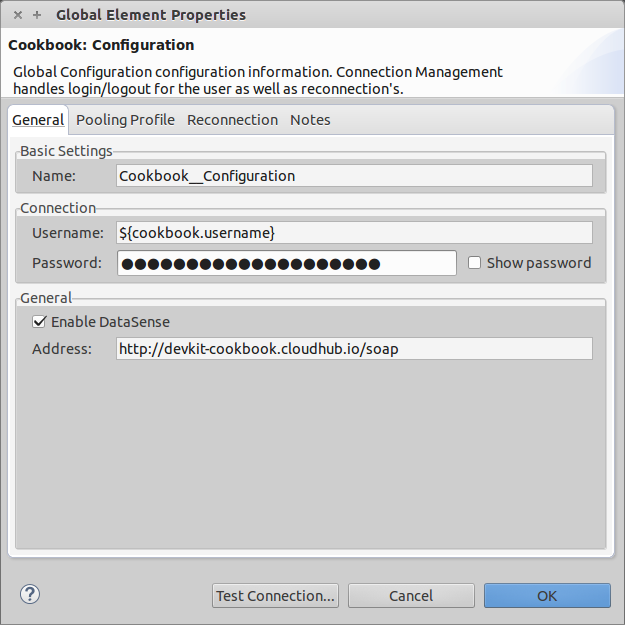

* A successful message should pop-up.

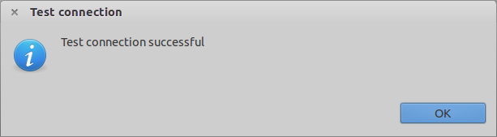

* Select **Run as Mule Application**. 

* Open a browser and access the URL `http://localhost:8081`. You should see the demo application deployed:

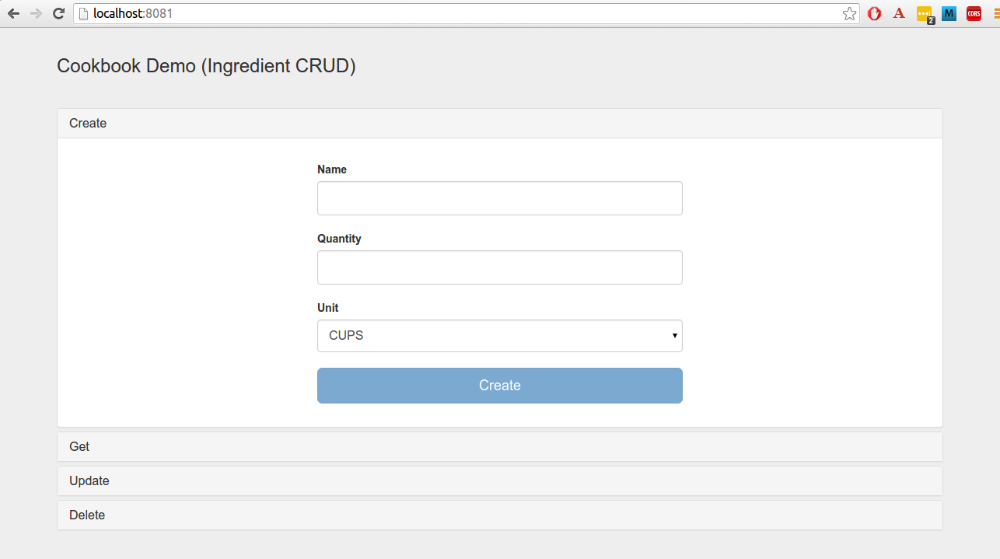
	
## About the flows

**1. Html_Form_Flow:** renders the HTML form with a `parseTemplate` component.

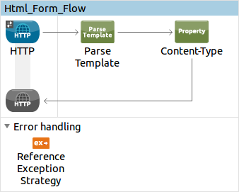

**2. Create_Ingredient_Flow:** saves a new Ingredient record to the Cookbook service.


**3. Get_Ingredient_Flow:** retrieves the information of an existing Ingredient given its ID.

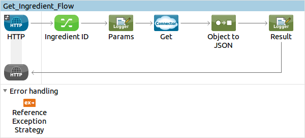

**4. Update_Ingredient_Flow:** modifies the Quantity and Unit fields of the Ingredient selected in the previous step. 

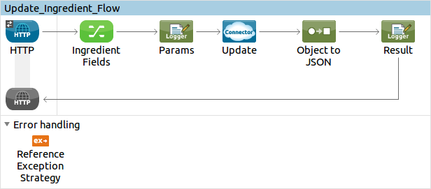

**5. Delete_Employee_Flow:** deletes an existing Ingredient given its ID.

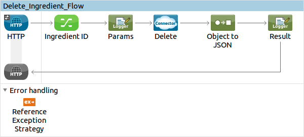

**6. Choice_Exception_Strategy:** global exception strategy that handles every exception that may arise at runtime and forwards it to the HTML form for better troubleshooting in the front-end side.

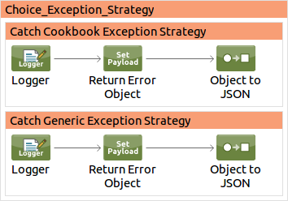

## Run the demo

### Create 
* Click the link **"Create"**.
* Fill in the following required fields: 
	* Name
	* Quantity
	* Unit
* Click the **"Create"** button and wait until the operation finishes processing.
* A pop-up message will indicate if the operation was successful or not.

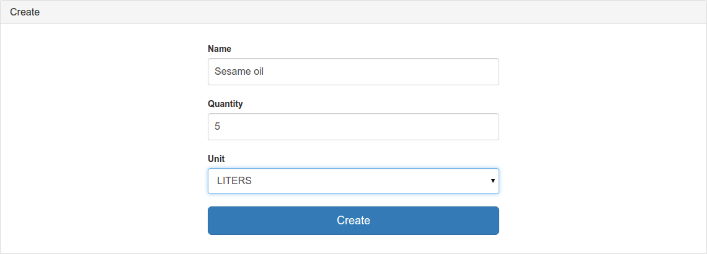

### Get 

* Click the link **"Get"**.
* Enter the ID number of a Ingredient.
* Click the button **"Get"** and wait a few moments to finish processing.
* A pop-up message will indicate if the operation was successful or not. 


### Update  

* Click the link **"Update"**.
* Fill in the fields to be modified: Quantity and/or Unit.
* Click the button **"Update"** and wait a few moments to finish processing.
* A pop-up message will indicate if the operation was successful or not. 

> In this step it is **mandatory** to execute the **Get operation** first to obtain the ID of the entity to be updated.

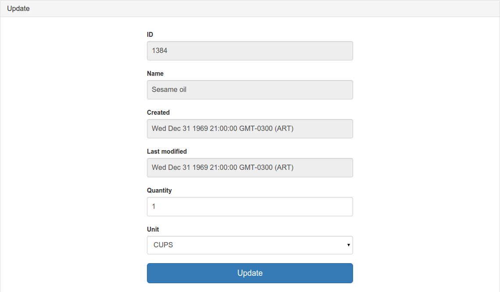

### Delete 

* Click on the tab **"Delete"**.
* Enter the ID number of a Ingredient.
* Click the button **"Delete"** and wait a few moments to finish processing.
* A pop-up message will indicate if the operation was successful or not. 


* **Congratulations!** You have successfully run this demo. Continue exploring the connector by playing with other available [demos](http://mulesoft.github.io/cookbook-connector/) or visiting the [Cookbook Connector Documentation Site](https://docs.mulesoft.com/mule-user-guide/v/3.7/cookbook-connector) and  the [DevKit Cookbook Tutorial](http://mulesoft.github.io/mule-cookbook-tutorial).