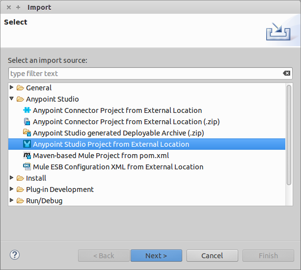
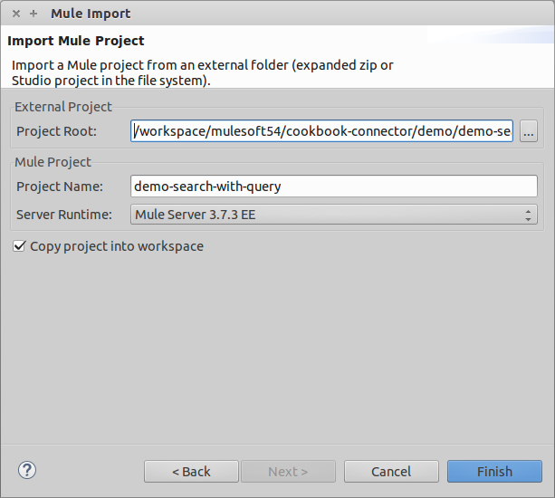
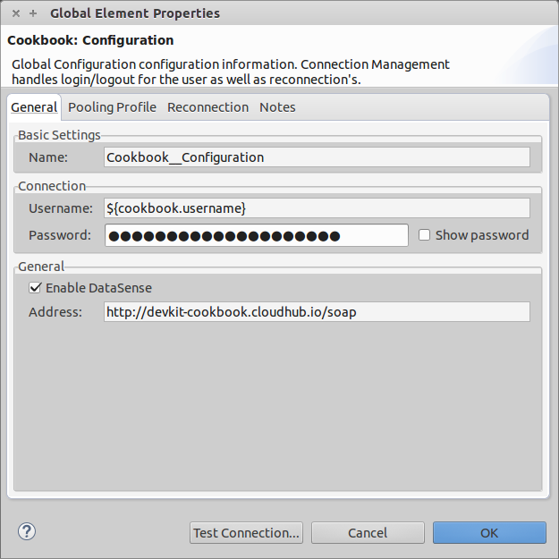
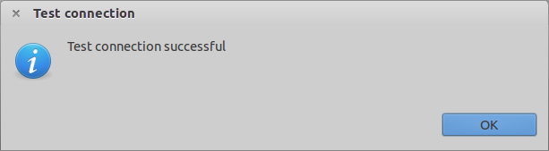
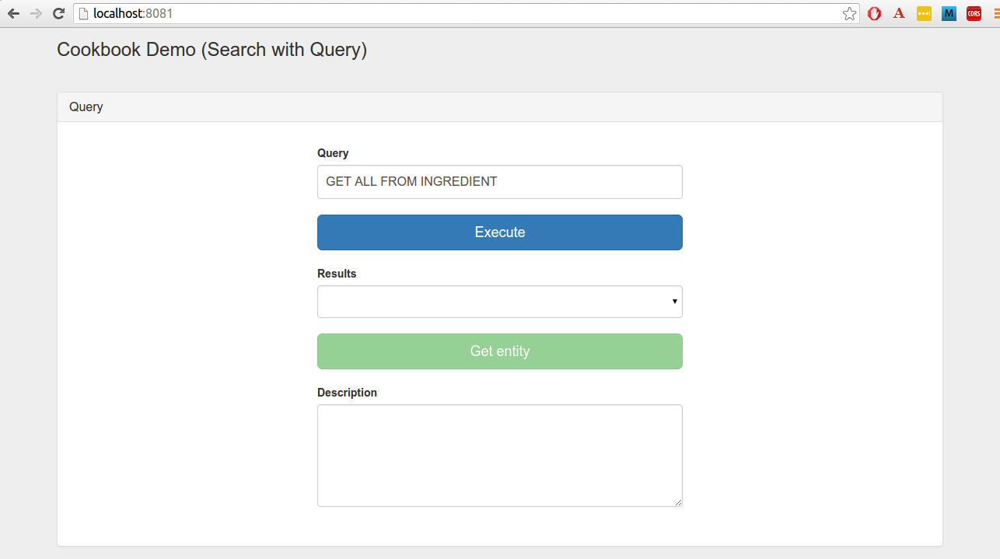
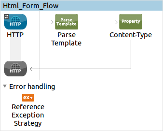
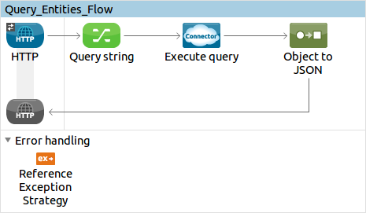
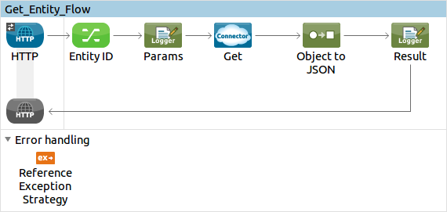
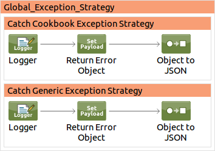
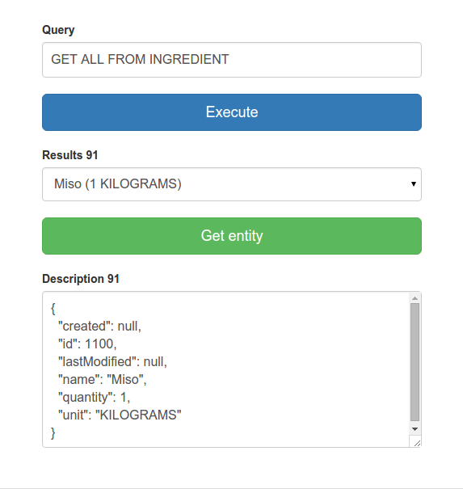

Cookbook Anypoint&trade; Studio Connector Demo (Search with Query)
==================================================================

## Introduction

The current demo application provides a simple workflow to **execute a query** that will retrieve (depending on the query) one or more Cookbook entities (Ingredients or Recipes) that the user will be able to select and fetch the complete description.

## Prerequisites

* Java 7
* Anypoint Studio 5.4.x
* Mule Runtime 3.7.0 EE or higher
* DataWeave

## Import the project

* Go to **File > Import**
* Select **Anypoint Studio Project from External Location** (under the parent folder "Anypoint Studio")



* Provide the root path to the demo project folder.
* Select Mule Runtime (3.7.x EE).



* Click **Finish**.  
* Set Cookbook credentials inside the file `src/main/app/mule-app.properties`.

```
config.username=<USERNAME>
config.password=<PASSWORD>
```
* Inside the Global Elements view, double-click the Cookbook Configuration component and click "Test Connection".



* A successful message should pop-up.



* Select **Run as Mule Application**. 

* Open a browser and access the URL `http://localhost:8081`. You should see the demo application deployed:


	
## About the flows

**1. Html_Form_Flow:** renders the HTML form with a `parseTemplate` component.



**2. Query_Entities_Flow:** executes a query in CQL (Cookbook Query Language) that fetches one or more entities that matches the specified pattern. A default query string is provided as example (GET ALL FROM INGREDIENT) which will retrieve all existing Ingredients. The results will be used to populate a dropbox for the Get operation below. 



**3. Get_Ingredient_Flow:** retrieves the information of an existing Ingredient selected from the results obtained in the previous step.



**4. Choice_Exception_Strategy:** global exception strategy that handles every exception that may arise at runtime and forwards it to the HTML form for better troubleshooting in the front-end side.


## Run the demo

### Query 
* Click the link **"Query"**.
* Enter the query to be executed or use the default value provided.

> The expected query syntax must comply with the format:
```
GET [ALL | field1, field2, fieldN]
FROM [INGREDIENT | RECIPE] 
MATCHING [clause] 
```
For further details on the CQL (Cookbook Query Syntax), refer to [Cookbook Connector Documentation Site](https://docs.mulesoft.com/mule-user-guide/v/3.7/cookbook-connector).

* Click the **"Execute"** button and wait until the dropdown list below is populated.
* Select one of the entities from the **Results** list.
* Click the **"Get entity"** button and wait a few moments to finish processing.
* The details of the entity will be displayed in the **Description** textarea.



* **Congratulations!** You have successfully run this demo. Continue exploring the connector by playing with other available [demos](http://mulesoft.github.io/cookbook-connector/) or visiting the [Cookbook Connector Documentation Site](https://docs.mulesoft.com/mule-user-guide/v/3.7/cookbook-connector) and  the [DevKit Cookbook Tutorial](http://mulesoft.github.io/mule-cookbook-tutorial).